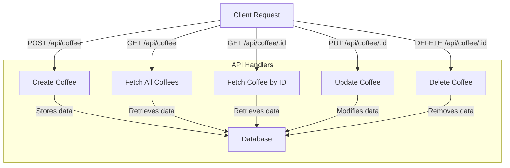
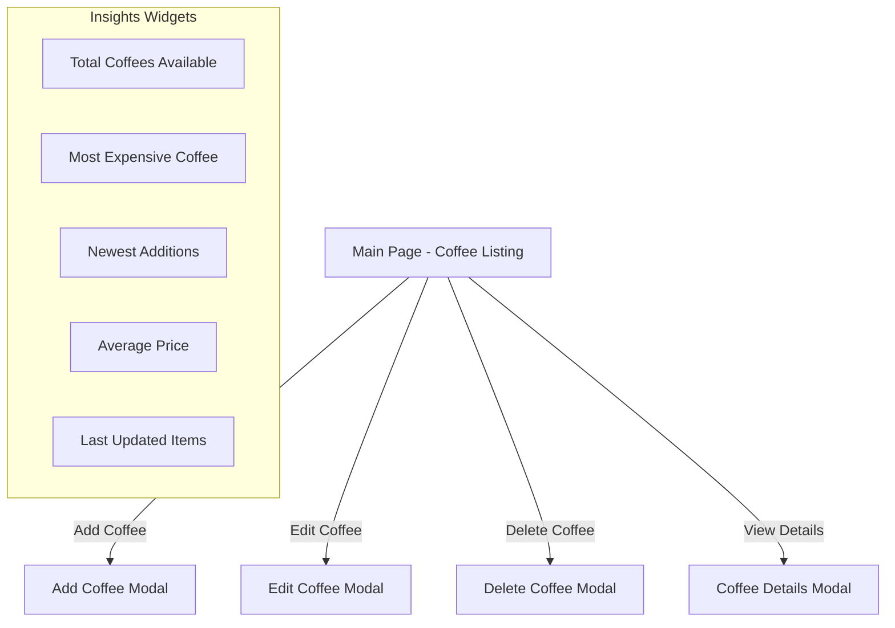

# Espresso-Code: T3-Stack Project with Next.js and Prisma

This project, **Espresso-Code**, was created using **T3-Stack**, with **Next.js** and **Prisma** as the ORM. Initially, an **SQLite** database (db.sqlite) was used, but for production, it will be necessary to migrate to **PostgreSQL**.

## 🛠️ Pre-requirements

### Install Node.js 22

You can install and manage Node.js versions using **nvm** ([nvm GitHub](https://github.com/nvm-sh/nvm)):

It is recommended to use **nvm** for managing Node.js versions:

```sh
nvm install 22
nvm use 22
```

Alternatively, install Node.js 22 directly from [nodejs.org](https://nodejs.org/).

### Install Bun (optional)

Bun can be used as an alternative package manager to npm:

```sh
curl -fsSL https://bun.sh/install | bash
```

Alternatively, you can use npm:

```sh
npm install -g bun
```

To check your installation:

```sh
bun --version
```

## 📄 Environment Variables

Create a `.env` file based on `.env.example`:

```sh
cp .env.example .env
```

Then, configure the required environment variables before running the project.

## 🚀 Development Steps

### 1️⃣ Initialize the Project

- Create the project using **T3-Stack**:

```sh
bun create t3-app@latest
```

- Set up dependencies and start the development server:

```sh
bun install
bun dev
```

### 2️⃣ Add Database and API CRUD

- Configure **Prisma** with **SQLite** (for local development)
- Define the database model:

```prisma
model Coffee {
  id          Int      @id @default(autoincrement())
  name        String   @unique
  description String?
  price       Float
  image       String
  createdAt   DateTime @default(now())
  updatedAt   DateTime @updatedAt
}
```

- Initialize Prisma and run the first migration:

```sh
bun prisma init
bun prisma migrate dev --name init
```

- Seed the database:

```sh
bunx prisma db seed # If using Bun

# If using Node with npm, install tsx and run:
npm install -g tsx
npx prisma db seed
```

- Build API CRUD endpoints for project entities ([Next.js API Routes](https://nextjs.org/docs/app/building-your-application/routing/router-handlers))

#### CRUD Operations



| Action  | Method | Endpoint         | Description |
|---------|--------|-----------------|-------------|
| Create  | POST   | `/api/coffee`    | Add a new coffee item |
| Read    | GET    | `/api/coffee`    | Fetch all coffee items |
| Read    | GET    | `/api/coffee/:id` | Fetch a specific coffee item |
| Update  | PUT    | `/api/coffee/:id` | Update a coffee item |
| Delete  | DELETE | `/api/coffee/:id` | Remove a coffee item |

### 3️⃣ Build the Dashboard

- Create the management interface
- Use **TanStack React Query** for data fetching and caching
- Use **ShadCN/UI** for accessible and easy-to-use components
- If needed, write standard HTML/React components, as the framework itself is irrelevant
- To speed up UI design, you may use **[v0.dev](https://v0.dev/)** or **[bolt.new](https://bolt.new/)** for AI-generated UI

#### Dashboard Flowchart



#### Cool Widgets for Insights

- **Total Coffees Available**: Displays the total number of coffee items.
- **Most Expensive Coffee**: Highlights the highest-priced coffee item.
- **Newest Additions**: Shows the most recently added coffee items.
- **Average Price**: Calculates and displays the average price of all coffee items.
- **Last Updated Items**: Lists coffee items recently modified.

### 4️⃣ Deploy to Production 🌐

- Switch database to **PostgreSQL**
- Set up the environment variable `DATABASE_URL`
- Run migration for production:

```sh
bun prisma migrate deploy
```

([Prisma Migrations](https://www.prisma.io/docs/concepts/components/prisma-migrate))

- Deploy the application to a production environment (e.g., Vercel, Railway, Render, etc.)

## 🛠️ Technologies Used

- **T3-Stack** (Next.js, TypeScript, Prisma, TanStack React Query, TailwindCSS)
- **Database:** SQLite (dev) → PostgreSQL (production)
- **UI Tools:** ShadCN/UI, v0.dev / bolt.new (optional)

## 🎯 Challenges

### 🚀 Mid-Level Challenge: Coffee Explorer

**Task:**
Enhance the coffee management system with **pagination, filtering, a comparison page, and similar item search**.

**Requirements:**
1. Implement **pagination** on the coffee listing page.
2. Add **filters** (e.g., price range, newest items, most popular, etc.).
3. Create a **comparison page** where users can select multiple coffee items and compare attributes.
4. Implement a **find similar search** that suggests coffees based on selected attributes (e.g., flavor profile, price, etc.).

**Bonus:** If you make it **fast, user-friendly, and visually appealing**, you’ll get… absolutely nothing! But you’ll know you did a great job. 🎉

### Improve the Coffee Management System

**Task:**
Update the project to handle **image uploads** for coffee items. You can choose to:
- Store images locally in a folder and serve them statically.
- Use a cloud service like **UploadThing** or **AWS S3** to store and retrieve images.

**Steps:**
1. Modify the API to accept image uploads.
2. Update the database schema to store image URLs.
3. Implement the UI to allow users to upload images when adding or editing a coffee item.

### 🏆 Ultra-Difficult Challenge: The Coffee Overlord

**Task:**
Implement a **recommendation system** for coffee pairings based on user preferences. The best solution wins a **bunch of nothing**! 🎉

**Requirements:**
1. Allow users to rate coffee items.
2. Analyze ratings to recommend similar coffee options.
3. Use AI/ML techniques (if you dare) or create a simple rule-based system.
4. Display recommendations dynamically on the dashboard.
5. Bonus points for making it **beautiful, fast, and scalable**.

### Improve the Coffee Management System

**Task:**
Update the project to handle **image uploads** for coffee items. You can choose to:
- Store images locally in a folder and serve them statically.
- Use a cloud service like **UploadThing** or **AWS S3** to store and retrieve images.

**Steps:**
1. Modify the API to accept image uploads.
2. Update the database schema to store image URLs.
3. Implement the UI to allow users to upload images when adding or editing a coffee item.

## 📌 Final Notes

- Ensure the database is switched before deployment.
- Keep migrations synchronized between development and production.
- Explore optimization possibilities with TanStack React Query and caching.

### 📚 Documentation Links

- [Next.js App Router](https://nextjs.org/docs/app)
- [Prisma Documentation](https://www.prisma.io/docs/)
- [Next.js API Routes](https://nextjs.org/docs/app/building-your-application/routing/router-handlers)
- [Prisma Migrations](https://www.prisma.io/docs/concepts/components/prisma-migrate)
- [TanStack React Query](https://tanstack.com/query/latest)
- [ShadCN/UI](https://ui.shadcn.com/)

---

💡 *This README may be updated as the project evolves!*

